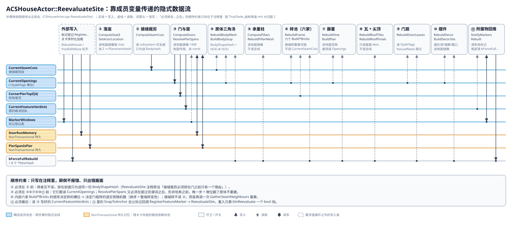

# Tiny Glade 复刻：结构审查

对 `ACSGroundActor` / `ACSHouseActor` / `UCSHouseSubsystem` 一族（[`Docs/TinyGlade/`](Docs/TinyGlade/index.md) 所记的 D1–D14）做一次整体结构审查。只谈结构性问题，不收集单点 bug；单点缺陷只在它能证明某个结构性问题时才列出。

- 审查基准：2026-09-06 14:50 前后的工作区，含尚未提交的改动（`git diff --stat -- Source`：32 个文件，+7997 / −1446）。源码在审查期间仍在被修改，行号按读取时刻记录，引用以函数名为主，行号在 ±30 内自行核对。
- 三条深挖：A「实例化产物管线」与 B「重求值数据流与哈希覆盖」已完成，结论并入对应小节；C「墙体 / 剖面契约 / 矩形假设」的深挖半途中断，该两节只含主审查阶段已核实的内容，未完成项列在各自末尾。
- 标注：**已核实** = 读到源码原文（含 UE 5.7.4 引擎源码）；**推测** = 由已核实事实推演、未跑过用例。

## 结论

- 底层架构站得住：CPU 权威镜像 → 声明式重求值 → 哈希守卫 → GPU 常驻，这条链的方向正确。纯函数层（`CSHouseProfile.h` / `CSHouseSeam.h` / `CSHouseQuoin.h` / `CSHouseTrim.h` / `CSHouseRoof.h` / `CSHouseResize.h` / `CSHouseDoorRuns.h`）质量高、有单测。
- 结构性问题集中在**编排层**：两个 actor 把十几条产物管线的状态机全部手写在自己身上，产物之间靠成员变量与注释约定的顺序传递数据，哈希输入靠手工枚举。本审查发现的绝大多数缺陷都由这一层产出，而且同一类缺陷会反复出现。
- 与 Tiny Glade 模型差异最大、也最贵的一条是矩形 footprint；其次是墙体两套表示并存而终局未定。这两条是方向问题，需要拍板而不是重构。

| 层 | 现状 | 评价 |
| --- | --- | --- |
| 纯函数层（剖面 / 接缝 / 角石 / 包边 / 屋面 / 拉尺寸 / 门段） | header-inline 纯函数，34 条逻辑单测 | 好，保持 |
| GPU 基座（`UCSMesh` / `UCSGpuInstancedMeshComponent` / `CSShaperSteps`） | 描述符驱动、异步编辑、计数阻塞刷新 | 好；但 buffer 结构与分配 / 释放有四份同构体（大问题 1） |
| 编排层（`ACSHouseActor` / `ACSGroundActor`） | 约 10.6K 行、235 个可编辑属性、7 条实例化产物家族 + 5 条 `UCSMesh` 产物（房体 / 柱 / 藤管 / 地面 / 岩壳） | **主要问题所在**（大问题 1、2，中等问题 6） |
| 数据模型（footprint / 洞 / 墙） | 矩形四边硬编码；墙 = 面板 + clip，砖层半成品 | **方向待拍板**（大问题 3、4） |
| 通知与注册（`UCSHouseSubsystem` / `OnGroundChanged` / 标记登记） | 直推 + 0.25 s 快扫兜底 | 可用；快扫基线漂移与地面 N 倍放大见大问题 2 |
| 测试与回归 | 纯函数单测 + 需真 RHI 的 Python 回归（13 处零阻塞断言） | 编排层无单测；砖层 / 墙高 / `LiftHeight` / 地被 / Undo / 销毁没有零阻塞断言 |

## 审查范围与量化

TG 相关源码共 30.2K 行（`CSHouse*` / `CSGround*` / `CSTinyGlade*`），全部位于 `Source/ComputeShaderGenerator/`（该模块合计 72.8K 行）。

| 文件 | 行数 | 说明 |
| --- | --- | --- |
| `Public/CSHouseActor.h` + `Private/CSHouseActor.cpp` | 2274 + 4217 | 房屋编排层，142 个 `EditAnywhere` 属性 |
| `Public/CSGroundActor.h` + `Private/CSGroundActor.cpp` | 1648 + 2447 | 地面编排层，93 个 `EditAnywhere` 属性 |
| `Public/CSHouseProfile.h` | 1019 | 洞剖面 / 裁剪场 / 谓词 / 边框架，header-only |
| `CSHouseSeam.h` / `Quoin.h` / `Trim.h` / `Roof.h` / `Resize.h` / `DoorRuns.h` / `BrickWall.h` | 353 / 139 / 192 / 195 / 72 / 257 / 130 | 纯函数层 |
| `CSHouseFrame` / `Vine` / `Tile` / `Decor`（h + cpp） | 972 / 988 / 626 / 735 | 实例化产物的记录生成与 GPU 打包 |
| `CSGroundRockShell` / `Stairs` / `Cover`（h + cpp） | 1288 / 502 / 506 | 地面派生产物 |
| `CSHouseFeatureMarker` / `HandleActor` / `Subsystem` / `TinyGlade` / `GroundShaperActor`（h + cpp） | 653 / 265 / 278 / 119 / 380 | 标记、抓手、注册表、基类、塑形物 |
| `Private/Tests/CSHouseLogicTests.cpp` | 4209 | 34 条纯函数单测（TG 相关自动化测试合计约 80 条） |
| `Shaders/Private/CSHouse*.usf` + `CSGround*.usf/.ush` | 2203 | 8 个 kernel |

| 指标 | 数值 | 出处 |
| --- | --- | --- |
| `Ensure*` / `Rebuild*` 函数 | 房子 13 个、地面 11 个；实例化产物的 `Ensure*` 每个 88–172 行 | 大问题 1 |
| 房子头文件里的缓存 / 哈希 / 交接 / BuiltFrom 字段 | 44 个 | `CSHouseActor.h` 私有段 |
| 把 footprint 当矩形的代码行 | 47 行、15 个文件 | `grep "Edge < 4\|\[4\]\|& 3\|% 4"`，大问题 3 |
| 单地面假设（`TActorIterator<ACSGroundActor>` 取第一个） | 3 处 | `CSHouseActor.cpp` / `CSGroundShaperActor.cpp` / `CSVineScatter.cpp` |
| 哈希守卫缺口（深挖 B） | 已核实 15 条 + 推测 3 条 + 提交侧 2 条 | 大问题 2 |
| 拷贝间现存不一致（深挖 A） | 12 条 | 大问题 1 |
| Python 脚本 | 72 个，其中 `TinyGladeShot*` 41 个 | `Scripts/` |
| 回归零阻塞断言 | 13 处（26 次 `get_blocking_flush_count` 调用） | `Scripts/TinyGladeDemoRegression.py` |

## 大问题

### 1. 实例化产物管线：同一套状态机复制了 8 份

**现象。** 房子里 Frame / Vine / RoofTile / Decor，地面里 Stair(+Pebble) / SkirtDecor / Cover / RockShell，每一家都在 actor 上手写同一套「Ensure 组件 → 预留容量 → 交接实例源 → 哈希短路 → 打包 → 撤源清零」的状态机。共同骨架（**已核实**，深挖 A 的 12 步矩阵）：

```cpp
// 八份 Ensure*Component 的共同骨架（伪代码；逐家写法见下表）
if (!IsValid(Component)) { Component = NewObject<UCSGpuInstancedMeshComponent>(this, NAME_None, RF_Transient); RegisterComponent(); }
Component->InstanceMaterial = Material;                        // 材质直写，不经哈希
SetBaseMesh / SetBaseMeshFromGpuData; *MeshBuiltFrom; b*Ready; // 后者无幂等早退，所以 actor 要自己记 BuiltFrom
if (GpuBuffers.Num() != N) { ReleaseOnRenderThread(); SetNum(N); Handed*.Reset(); }
Buffers.BaseSphere / BlockSize = f(网格包围盒, 参数);          // 只在这里算，之后烘进实例记录
CSShaperSteps::ReserveCapacity(Buffers, ReserveCount(上界));   // 注册期一次付清；漏 ReserveCount = 拖动中周期性阻塞
LocalBounds = QuantizeUp(...); if (!bForceFullRebuild) LocalBounds += Handed*LocalBounds;   // 只涨不缩
bNeedHandover = 容量变 || 盒变 || !HasInstanceSourceGPU() || ...;                           // 五条件
if (bNeedHandover) { Component->SetInstanceSourceGPU(Source); Handed* = ...; }             // 阻塞
```

| 产物 | `Ensure*` | `Rebuild*` | 备注 |
| --- | --- | --- | --- |
| 房子 Frame（门框 / 接缝 / 转角墩 / 角石 / 包边 / 砖层六家共用一个组件） | 88 行 | 106 行 | 六家 `Build*Bricks` 的顺序决定槽位 |
| 房子 Vine（枝 / 叶 / 花三调色板 + 管子 `UCSMesh`） | 170 行 | 148 行 | 管子走 `EditMeshAsync` |
| 房子 RoofTile | 127 行 | 64 行 | 尖顶另走普通 `UStaticMeshComponent` |
| 房子 Decor（N 调色板） | 162 行 | 90 行 | |
| 地面 Stair + Pebble | 103 行 | 136 行 | 容量 / 包围盒 / 交接放在 `Rebuild` 里 |
| 地面 SkirtDecor（N 调色板） | 172 行 | 83 行 | |
| 地面 Cover（N 物种） | 90 行 | 152 行 | 任一网格变 ⇒ 全部重建 |
| 地面 RockShell（`UCSMesh`，非实例路） | 138 行 | 111 行 | 不适用交接，但同样的哈希 / BuiltFrom 形态 |

**深挖 A 的补充发现（除注明外均已核实，行号为读取时刻）。**

1. 公共部分不止八份 Ensure：buffer 结构、分配、释放各有三份同构体（`CSShaperSteps::FPaletteBuffers` / `CSGroundStairs::FStairBuffers` / `CSGroundCover::FCoverBuffers`；`ReserveCapacity` / `CSGroundStairs::EnsureBuffers` / `CSGroundCover::EnsureBuffers`；三份 `ReleaseOnRenderThread`），组件侧还有第四份同构体 `FCSGpuInstanceSourceGPU`。
2. 门框砖是现存唯一漏掉 `ReserveCount` 台阶的一份：`EnsureFrameComponent` 把 `EffectiveFrameCapacity()` 直接喂 `ReserveCapacity`，而砖层开着时该上界 = `Authored + EstimateBricks(FootprintSize, WallHeight, …)` 是连续量，`ReserveCapacity` 只对齐 64。砖层默认关（`bBrickWallEnabled`），回归脚本从不打开，所以 13 处零阻塞断言全部看不见。这正是藤蔓那轮「拖一段 21 次阻塞刷新」的同一失败模式。
3. `*HandedCapacities` / `*HandedLocalBounds` 是组件已有状态的副本：`FCSGpuInstanceSourceGPU` 自带 `Capacity` 与 `LocalBounds`，组件公开 `GetInstanceSourceGPU()`。八家 actor 侧缓存可以零行为变化地删掉；历史上「撤源后没清 Handed」的漂移只会发生在副本上。
4. 释放路径不对称：地面在 `EndPlay` / `Destroyed` 里释放三家；房子四家在 `Destroyed` / `EndPlay` / `BeginDestroy` 里一处都不释放，组件自己也没有 `BeginDestroy`（对比 `UCSMesh::BeginDestroy`）。UE 5.7 的 `FRDGPooledBuffer` 是原子引用计数、池子 30 帧滞后释放，所以今天不是竞争，是显存滞留到 GC 加纪律不对称。
5. 八处注释里「蓝图重跑构造脚本会销毁组件」这句成因写错（引擎源码核实）：`DestroyConstructedComponents` 只销毁 `CreationMethod ∈ {SCS, UCS}` 的组件，`NewObject` 出来的组件恒为 `Native`。`IsValid` / `HasInstanceSourceGPU` 兜底仍然必要，真实触发源是 Undo 回滚 Transient 指针、加载 / 复制 / PIE 后指针为空、以及自家 `DestroyComponent` 路径。
6. 其它现存差异：摆件 Pop 时不 `ClearInstanceSourceGPU` 就 `DestroyComponent`；裙边包围盒没有 `bForceFullRebuild` 概念、永不收紧；石阶 / 地被包围盒不量化、不棘轮且吃 `MaxAbsHeight`（拖 `LiftHeight` 会每帧交接，无断言）；地被 / 岩壳把哈希短路放在 Ensure 之前（组件失效而输入未变时静默不画）；`SetBaseMeshFromGpuData` 没有幂等早退，这是六个 `*BuiltFrom` / `b*Ready` 字段存在的根因；三份 buffer 结构的「必须有效」契约不同（石子必须始终有效、藤的花可选、地被要求 buffer 数等于物种数）。

**后果。** 同一个 bug 要修 N 遍，且回归只覆盖其中几份。历史上已经发生三次：藤蔓漏台阶 21 次阻塞刷新、门框砖撤源前没清 counter 留下 12 层幽灵砖、组件重建后新组件没实例源。

**建议：两层拆分（深挖 A 的归属方案，推测）。**

- 交接缓存归组件：`bNeedHandover` 改为比较 `Component->GetInstanceSourceGPU()` 的 buffer 指针 / `Capacity` / `LocalBounds`，删掉八家 `Handed*`。撤源即清缓存，零行为变化。
- pooled buffer + 家族编排归 actor 持有的 helper struct，一份泛型 Ensure：

```cpp
struct FCSInstancedPalette {                              // 一个 palette = 一张网格 = 一个组件 = 一对 buffer
	TObjectPtr<UCSGpuInstancedMeshComponent> Component;   // 宿主 actor 以 UPROPERTY(Transient) TArray 暴露
	CSShaperSteps::FPaletteBuffers Buffers;               // Packed / Counter / Capacity / BaseSphere / BlockSize
	TObjectPtr<UStaticMesh> MeshBuiltFrom;                // 仅 SetBaseMeshFromGpuData 路需要
	bool bOptional = false;                               // 藤的花：网格可空、buffer 照分配
};
struct FCSInstancedFamily {
	TArray<FCSInstancedPalette> Palettes;
	FBox HandedBounds;                                    // 只涨不缩的记忆；bForceFullRebuild 时丢弃
	bool bBaseMeshReady = false;
	uint32 DescHash = 0;
	// Ensure(Desc)：Desc 只提供策略——每 palette 的网格 / 材质 / 换轴码 / BlockSize 公式、
	//   容量上界（类型上强制已过 ReserveCount）、包围盒公式、bForceFullRebuild
	// Release() / ZeroAndClear()：唯一的撤源顺序（ZeroCounters → Clear → 清缓存）与唯一的释放入口
};
```

- 变体表达：Frame = 1 个 palette，六家只是同一张记录表的六个生产者；Vine = 3 个 palette（花 `bOptional`），管子不是实例，保持 `VineTubeComponent` + `VineTubeMesh`；Cover = N 个 palette，逐 palette 带材质与投影；Stair + Pebble = 2 个 palette 共享一份 `HandedBounds`，`FStairBuffers` 拆成两条 `FPaletteBuffers`；RockShell 不进这套。
- 不用 `CreateDefaultSubobject` 解决：它没有多买到任何「重跑存活」（Native 的 `NewObject` 组件本来就存活），也表达不了 N 调色板。
- 规模估算：现状约 1310 行（四份房子 Ensure 543 + 撤源 84 + 地面 522 + 三份 buffer 设施 165），抽象后约 550 行，净删约 700 行；约 60 个平行字段合并为 7 个 `FCSInstancedFamily` 实例。
- 最容易踩的坑：容量上界必须在类型上强制过 `ReserveCount`，否则砖层那条缺口会以新面孔回来；撤源顺序与「Ensure 在哈希前」必须保住；释放入口在两个 actor 的 `EndPlay` 和 `Destroyed` 都要调，`BeginDestroy` 里不能放任何 `*Sync`。回归脚本对砖层、墙高拖动、`LiftHeight`、开关家族、Undo、销毁、地被整条都没有零阻塞断言，重构前先补。

### 2. `ReevaluateSite`：靠成员变量传递的隐式数据流，哈希守卫手工枚举

**现象。** 重求值按固定顺序跑 11 步，步骤之间通过成员变量传中间结果，「必须排在…之后」只写在注释里。每个产物手工枚举自己的哈希输入，读集与哈希集靠人对齐。



生产者 / 消费者（**已核实**。步骤编号：① 落座 ② `ComputeSeamCuts` ③ `ComputeDoors` + `ResolvePierSpans` ④ 房体 ⑤ 柱 ⑥ `RebuildFrame` ⑦ 藤 ⑧ 瓦 + 尖顶 ⑨ 门扇 ⑩ 摆件 ⑪ `NotifyMarkersRebuilt`）：

| 成员状态 | 写 | 读 | 循环之外的写入者 |
| --- | --- | --- | --- |
| Actor 变换 Z | ① | ②③④⑤⑥⑦⑧⑨⑩⑪ | gizmo / `PushEdge` / 序列化 |
| `CurrentSeamCuts` | ② | ④ | — |
| `CurrentOpenings`（含 `StyleFlags`） | ③（Reset → 重建 → Sort → 打墩位） | ④⑥⑦⑨⑩ | Undo 恢复（Transient UPROPERTY） |
| `CornerPierTopZ[4]` | ③ | ⑥（转角墩、角石） | — |
| `CurrentFeatureVerdicts` | ③ | ⑪ | — |
| `MarkerWindows` | ⑪（清失效） | ③ | `RegisterFeatureMarker` / `UnregisterFeatureMarker`（标记 Tick / PostEditMove / Undo / 销毁） |
| `DoorRunMemory` / `PierSpanIsPier`（NonTransactional 持久） | ③ | ③ | 序列化加载；`RebuildHouse` 清空 |
| `bForceFullRebuild` + 8 个 `*DescHash` | 尾部清零 | ④⑤⑥⑦⑧⑨⑩ | `RebuildHouse` / `PostEditMove(true)` / `PushEdge` / `PushHeight` |
| `Pending*Snapshot`、`*BuiltAtTransform`、`*PlacementHash` | ④⑤⑦ | 异步尾巴 | `OnBodyEditComplete` / `OnPillarEditComplete` / `OnVineTubeEditComplete` |

只存在于注释里的顺序约束（**已核实**，代码没有任何断言或类型保障）：

| 约束 | 颠倒后的症状 |
| --- | --- |
| ① 在 ②③⑤⑦⑩ 前（都读落座后的 Z） | 门宽收窄、柱长、藤空隙、摆件落高按落座前的 Z 算一轮 |
| ② 与 ③ 在 `BodyHash` 前；③ 内部窗谓词在门后、`ResolvePierSpans` 在窗后、形状哈希在墩后 | 被拒的窗算进墩；墩位翻了哈希不翻 ⇒ 房体不重建 |
| ③ 在 ④⑥⑦⑨⑩ 前 | 各家用上一轮洞表，只有下一次唤醒才追上，而下一次唤醒无人保证 |
| ⑥ 内六家顺序（门框 → 接缝 → 转角墩 → 角石 → 包边 → 砖层） | 槽位推移 ⇒ 门框砖逐实例随机换色；撞容量时被截断的换家 |
| ⑪ 在 ③ 后 | 被挤掉的窗仍说「我切出洞了」 |
| ⑦ 在 ⑥ 后、⑧ 瓦在尖顶前、⑩「排最后」 | 无数据依赖，颠倒无症状（注释把它们写成了约束） |

另外两条结构性细节：接缝在一次重求值里算两遍（`ComputeSeamCuts` 与 `BuildSeamBricks` 各调一次 `GatherSeamNeighbours`）；`ComputeDoors` 是有副作用的非 const 函数，`MakeOpeningSite` 在它循环中途读半成品的 `CurrentOpenings`（有意为之，但只有注释保护）。

**哈希守卫缺口（深挖 B，逐一对照哈希输入与 `Rebuild*` 的真实读集）。**

| # | 产物 | 缺口 | 触发操作 | 标注 | 严重度 |
| --- | --- | --- | --- | --- | --- |
| V1 | Vine | 哈希只记枝 / 叶 / 花三个计数；`BuildPlan` 对洞是侧移 / 镜像绕行不删段 | 窗标记沿墙挪 30 cm、门加宽 | 已核实 | 高（藤穿新洞） |
| F4 | Frame | 容量涨 ⇒ `GrowTo` 新分配不拷不清，哈希不变 ⇒ 早退 | 改大 `FrameReserveCapacity` | 已核实 | 高（砖消失 / 垃圾） |
| D1 | Decor | palette 数不入哈希 ⇒ 新 buffer 从未 Pack（地面侧 `SkirtDecorHash` 反而含） | 往 `DecorGateMeshes` 加一张 | 已核实 | 高 |
| V7 | Vine | `WallThickness` 不入哈希，`Strip.Origin` 随它变 | 改墙厚 ⇒ 藤悬空或嵌墙 | 已核实 | 中 |
| V5 | Vine | `BlockSize` 只在快照期算，记录里的绝对长度却每次算 | 改 `VineLeafSize` ⇒ 叶变长不变宽 | 已核实 | 中 |
| F1 | Frame | 砖尺寸参数只在有洞时才 append 进哈希 | 无洞房改 `FrameBrickBloat` ⇒ 角石不胀 | 已核实 | 中 |
| F2 | Frame | `FrameBrickMesh` 身份 / 包围盒不入哈希，`BlockSize` 已烘进记录 | 换一张不同尺寸的砖 | 已核实 | 中 |
| V3 | Vine | `bVineUseTube` 不入哈希 | 关管子模式 ⇒ 管子留着、实例不出 | 已核实 | 中 |
| V6 | Vine | 网格身份不入哈希 | 换 `VineLeafMesh` ⇒ 旧 BlockSize 配新网格 | 已核实 | 中 |
| L1 | DoorLeaf | `ArchRise` 不入哈希 | 改 `DoorMaxArchRise` ⇒ 门扇高度不跟 | 已核实 | 低–中 |
| V4 / V2 | Vine | `VineTubeSegments` / `VineTubeSubdivide` / `VineHoleClearance` 不入哈希 | 改这些参数不重建 | 已核实 | 低 |
| D2 | Decor | `PierWidth` 只进容量上界不进哈希 | 改它跨过台阶 ⇒ 未 Pack | 已核实 | 低 |
| B1 | Body | `PierWidth` 不入哈希 | 面板格边界变、UV 接缝挪动 | 已核实 | 极低 |
| B2 | Body | `RoofPitch` / `RoofOverhang` 过度包含 | 改坡度 ⇒ 房体白重传 | 已核实 | 性能 |
| F3 / V8 / D3 | Frame / Vine / Decor | 自动厚度经 1 cm 量化间接入、采样密度经 max 间接入、`Facing` 不入 | — | 推测 | 低 / 形式 |
| — | Tile / Finial / Pillar / Placement / Seam / Quoin / Trim / BrickWall / 地面三家 | 无缺口 | — | 已核实 | — |

**提交侧与重入（深挖 B）。**

- A2（**已核实，真 bug**）：`RebuildPillarMesh` 空表分支置 `PillarMesh = nullptr` 但不清 `PendingPillarSnapshot`。帧 1 两次唤醒攒下 pending，帧 2 地面抬高柱集合变空，随后旧编辑完成补发 pending ⇒ 已作废的柱子复活，并被相等的哈希锁死。对照 `RebuildVine` 的关闭分支会 `PendingVineTubePath.Reset()`。
- A1（已核实）：`BuildUploadPayload` 失败只打 Warning，`BodyShapeHash` 已推进 ⇒ 形状再变前不重试；`SubmitVineTube` 被拒同样不重试。
- 重入：主审查假设的「⑪ `SnapToAnchor` → 标记 `PostEditMove` → `RegisterFeatureMarker` → 嵌套 `ReevaluateSite`」在 5.7 里不可达（`SetActorTransform` 不发 `PostEditMove`），所以没有诉求被吞；但 `bInReevaluate` 早退没有待办补偿，一旦将来可达就是静默丢失（快扫的 `GetTrackingHash` 不含 `MarkerWindows`，标记下一 tick 又因 `Window == Demand` 早退）。
- 标记侧真缺口（已核实）：`ACSHouseFeatureMarker` / `ACSWindowMarker` 没有 `PostEditChangeProperty`，spawn 出来的标记在细节面板改 `Width` / `Height` / `Shape` 不会重新登记，要再拖一次才生效。
- 落座的 `SetActorLocation` 不会同步再入（引擎里不触发 `PostEditMove`），`bInReevaluate` 是防御性守卫。但它让快扫基线漂移：只有子系统自己驱动的重求值才回写基线，其它入口落座改 Z 后 0.25 s 内必再醒一次，邻居因 `N.BaseZ` 进哈希也各醒一次。
- 「哈希短路零成本」只对 GPU 录 pass 成立：每次重求值的 CPU 规划相（约 450–550 次镜像双线性采样 + 六家砖求解 + 藤规划 + 锚点规划）每次全付，估 0.1–0.5 ms / 栋（推测）。地面直推是 N 倍放大器：每 dab 一次广播，每栋无视 `ChangedBounds` 全量规划。

**建议：把重求值输入固化成只读的 `FCSHouseSiteState`（深挖 B 的方案，推测）。**

- `ReevaluateSite` 入口、落座之后唯一一次触碰属性 / 地面 / 子系统 / 资产包围盒 / 组件变换，拍成一个按值拷贝的只读 struct：摆位（`Build` 变换、`WorldToComponent`）、几何参数、`FCSRoofDesc`、门参数块、地面探针（落座采样、环采样权重与空隙、柱空隙、四面墙条空隙）、邻居表、诉求（`Windows` + `MarkerWindows` 展开后的候选）、资产身份 + 包围盒、各家参数块、容量。
- 派生层 `CSHouseDerive::Run(const State&, const Memory& Prev, Memory& Next, Derived& Out)` 是纯函数：产出 openings（含 `StyleFlags`、verdicts）、seam cuts、corner tops、pillars、frame elements、vine plan、tiles、leaves、decor plan。两张持久记忆变成显式的 Prev / Next 入参，不再是成员副作用；`RebuildHouse` = 传空 Prev。它能进无 world 的单测。
- 每家一个切片结构体，切片类型就是 `Rebuild*` 的参数类型；哈希由通用的「量化字段序列化 + CRC」对整个切片求，不再手写 `H.Append({...})`。读集与哈希集因此天然相等，漏字段只剩「没放进切片」一种错误。材质单独走 `AppearanceHash` 驱动 `Bind*Materials` + `MarkRenderStateDirty`。Vine / Decor 这类「产物才是诚实来源」的家，切片 = 输入 ⊕ 产物摘要（每根 strand 的 RootKey + 点数 + 末点），不是三个计数。
- 改完后自动消失的缺口：V1–V8、F1–F4、D1–D3、L1、B1、B2。不会消失、要另修的：A1 / A2（提交侧要 `SubmittedHash` 与 `AckedHash` 两级，空表分支清 pending）、`GrowTo` 不清零（扩容后强制重录，或分配时 `AddClearUAVPass`）、材质直写不刷、标记缺 `PostEditChangeProperty`、`bInReevaluate` 无待办、快扫基线漂移（`ReevaluateSite` 末尾回写基线）。

### 3. 矩形 footprint 硬编码已渗透到 15 个文件

**现象（已核实）。** 把 footprint 当矩形的代码行 47 处、15 个文件；`FCSHouseWindow::EdgeIndex` 的 `ClampMax = 3`；`CornerPierTopZ[4]`；`CSHouse_GetEdge(int32 EdgeIndex, FVector2D, T)` 按 0..3 switch；四个拉尺寸抓手 + 一个高度框。

| 文件 | 命中行 | 类别 |
| --- | --- | --- |
| `Private/CSHouseActor.cpp` | 16 | 门的闭环采样、跨角配对、四面墙条、抓手生成 |
| `Public/CSHouseSeam.h` | 6 | 接缝：逐边裁剪、交点（推测：相交判定按矩形 OBB 写） |
| `Public/CSHouseProfile.h` / `Roof.h` | 4 / 4 | 边框架 switch；屋面直骨架取四条边的最小内距 |
| `Private/CSHouseDecor.cpp` / `CSHouseTile.cpp` | 3 / 3 | 锚点逐边、瓦逐坡 |
| `Public/CSHouseQuoin.h` / `Trim.h` / `BrickWall.h` / `Resize.h` / `CSHouseActor.h` | 2 / 1 / 1 / 1 / 1 | 角石四角、包边四边、砖层四边、推拉边号、窗边号钳位 |
| `HeightHandleActor` / `ResizeHandleActor` / `CSHouseFrame.cpp` | 2 + 1 / 1 / 1 | 抓手摆位、门框边号 |

**为什么是结构问题。** 计划书开放问题里自己写了「footprint 应从 `FVector2D` 升级为闭合折线，是 D6/D7 之前值得做的前置重构」（[`TinyGladeHouse_Plan.md`](Docs/TinyGlade/TinyGladeHouse_Plan.md) 约第 1923 行，当时数到五处硬编码），但 D5 / D6 / D7 / D8 / D12 / D13 全在矩形上又盖了一层，现在是 47 处。TG 的墙是任意闭合曲线，这是本项目与 TG 模型差异最大的一条，也是拖得越久越贵的一条。`ComputeDoors` 已经把四条边接成闭合周界求解（2026-09-04），说明代码在往「周界折线」走，只是数据表示没跟上。

**若升折线，各类要改什么（推测）。**

- 数据表示：`FootprintSize` → 闭合折线 + 边索引任意；`CSHouse_GetEdge` 从 switch 变查表。机械改动，量大但不难。
- 按线段写的纯函数（门段求解、包边、砖层、藤蔓墙条、摆件锚点）天然可推广。
- 要重写的：屋面（矩形直骨架内距对凹多边形不成立，要换真正的直骨架或另一种屋面算法）；角石与转角墩（非 90° 角的「角」概念）；接缝（矩形 OBB 相交与逐边裁剪）；四个抓手（每边一个）。
- 深挖 C 未完成的项：精确的逐类改动清单与规模、`CSHouseSeam.h` 相交判定是否矩形专用。

### 4. 墙体两套表示并存，两套都不是终局

**现状（已核实）。**

| 路线 | 状态 | 位置 |
| --- | --- | --- |
| 实心面板三角汤 + UV1 解析裁剪场 + 材质 `OpacityMask` 逐像素 discard | **实际在画的路**；两层裁决后按计划「将退役」 | `CSHouse_BuildBodySoup`、`FCSOpeningClipField` / `CSHouse_ClipKeeps`（`CSHouseProfile.h`）、`M_TinyGladeWall` |
| 砖层（TG 真两层之 A）= `CSHouseTrim::BuildBand` 一摞包边带 | 默认关，头注释自述「不是终局形态」；①删实例 ②水平贴合已做，③逐顶点垂直贴合未做 | `CSHouseBrickWall.h`、`BuildBrickWallBricks` |
| 灰泥层（两层之 B）= 规则栅格 + 逐顶点覆盖度 | 零代码；`PeelBias` 仍在材质里顶替覆盖度 | 计划书 D4「墙的两层结构」 |
| ④ 逐像素兜底 | 2026-09-06 裁决作废，但面板路完全靠它 | 同上 |

同一条洞曲线的消费者：面板裁剪场（UV1）、材质里手翻的 `CLIP_HLSL`（[`Scripts/TinyGladeMakeWallMaterials.py`](Scripts/TinyGladeMakeWallMaterials.py) 约第 79 行，自称「逐字翻译」，无任何自动校验）、`CSHouse_OpeningHalfWidthAtZ`（砖层 / 包边裁行，有意用 `<=` 而 `ClipKeeps` 用 `<`）、`CSHouseFrame` 沿洞缘铺砖、`CSHouseVine` 避洞（调 `CSHouse_ClipKeeps`）、`CSHouse_QueryOpening` 谓词、门扇读洞宽与 `Rise`。`CSHouse_SillMinZ` 同时约束「砌窗台盒」（面板路）与「砌窗台砖」（门框路），砖层开着时窗下方是窗台盒 + 窗台砖 + 砖层砖三重叠（推测，依据头注释「现在开 = 在墙板外面再糊一层砖」）。

本次逐字比对 `CLIP_HLSL` 与 `CSHouse_ClipKeeps`（Arch / Rect / Circle、`Shape * 255 + 0.5` 量化、哨兵 (8, 8)、B 通道 255）：当前一致。风险不在今天，而在「改一处漏一处」没有任何防线。

**后果。** 两层做完之前面板路和砖层路都得维护，验收门又要求两条路逐像素相同；改洞的任何语义要动三到四处。

**建议。** 先定灰泥层的形态再动砖层；如果两层要推迟，就明确把面板路定为当前终局，并让 HLSL 判据从 C++ 常量生成（脚本读同一个源）或加一条采样点对照测试，把「逐字对应」从人肉变成自动。深挖 C 未完成的项：各消费者对 `<` / `<=`、拱脚以下无下界、`ArchRise` 的逐条比对；两层落地的逐项差距与最小可交付终局。

## 中等问题

### 5. 变换契约靠约定不靠代码

房子只支持 yaw（`GetBuildTransform()` 只取 yaw + 位置），地面只支持平移（`CSGroundActor.h` 类注释「仅支持平移」），但 `PostEditMove` / `PostEditChangeProperty` 不夹任何 pitch / roll / scale。实例组件用完整的组件变换，构建空间只取 yaw，`EnsureFrameComponent` 的注释自己写着「只有在房子没有 pitch/roll/缩放时才重合」。用户在编辑器里随手一转就静默错。建议在编辑钩子里把不支持的分量钉死，或至少 `ensure`；若要支持，就把 `GetBuildTransform()` 与组件变换统一成一个口径。

### 6. 每次属性改动 = 两次全量重求值 + 全部实例源重交接

**已核实（引擎 5.7.4 源码，深挖 A / B 共同结论）。** 细节面板改任一属性：`AActor::PostEditChangeProperty` → `UnregisterAllComponents` → `RerunConstructionScripts`（原生类也放行）→ `ReregisterAllComponents`。链上 `OnConstruction` 触发第一次 `ReevaluateSite`，`PostRegisterAllComponents` 触发第二次并重写快扫基线；Unregister / Reregister 让所有实例组件丢掉实例源，每一家再付一次阻塞的 `SetInstanceSourceGPU` 交接。gizmo 松手帧同样两次（`Super::PostEditMove(true)` 先重跑构造脚本走一次无 force 的普通轮，回到 override 后再置 force 走一次）；抓手每个拖动事件也是两次（`PushEdge` 自己重求值一次，`MarkHouseDirty` 又让子系统下一 tick 再来一次）。蓝图子类拖动中每帧还多一次 `OnConstruction`。

这一条取代主审查最初的判断「transient 组件被构造脚本重跑销毁」：组件对象存活，被拆掉的是注册状态与实例源。建议：`PostRegisterAllComponents` 判「已登记且 `TrackingHash` 未变」则跳过；`PushEdge` / `PushHeight` 不再 `MarkHouseDirty`；把「细节面板改一个属性」的 flush 计数纳入零阻塞断言。

### 7. 模块边界与仓库卫生

- 计划里的 `CSHouse` 模块没拆（计划书「模块与文件布局」约第 73 行）。3 万行 TG 代码住在 7.3 万行的 `ComputeShaderGenerator` 里：Runtime、Win64、链 OpenVDB / TBB / D3D12 / Landscape / Foliage。`CSHouseActor.h` 包含 13 个 TG 头，改任何一个头全量重编。
- `ACSGroundShaperActor` 继承 `ACSTinyGlade` 但从不用网格底座（石阶已搬去地面），每座塑形物白带一个 `UCSMeshRenderComponent`；计划书写的是「纯 AActor，非 ACSTinyGlade」（约第 101 行）。
- 单地面假设：3 处 `TActorIterator<ACSGroundActor>` 取第一个，无守卫。
- `Scripts/` 72 个脚本里 41 个 `TinyGladeShot*`，含 `TinyGladeShotStairsWhere1` 到 `7` 这类调试探针。`Docs/TinyGlade/` 下有 7 个 `.hip` 备份、`out/` 里的 bgeo / obj 二进制、PLY 缓存 `lextab.py` / `yacctab.py`（文档目录与工程根各一份）。`Content/HouseTest` 189 MB 中 473 个网格无引用。
- 文档三份合卷 1.1 MB，追加式加删除线；`index.md` 自述「权威进度在卷零但卷零尚未回填」。新读者要从三层裁决订正里反推当前状态。

## 已知但不算结构问题

- 窗有两个来源、能力不一致：`Windows` 属性表只出洞，`MarkerWindows` 的标记带预制网格。2026-09-06 之后前者是遗留分叉。回归脚本与 `TinyGladeShotWindow.py` 各用哪一种，深挖 C 未核。
- 藤蔓三代并存：`AVineContainer` 空间殖民（接不上房子）、实例枝（`bVineUseTube` 关）、管子（默认）。
- `DoorRunMemory` / `PierSpanIsPier` 是持久化的路径依赖状态，与「目标态 = 纯函数」有张力。已知且可接受；Undo 后 Transient 的 `CurrentOpenings` 会恢复、两张记忆不会，靠 `PostEditUndo` 重算收敛。
- 房体材质槽 1（`ECSHousePart::Roof`）四坡改瓦后零三角，`RoofMaterial` 实际只被瓦片组件用；槽表因「P2 冻结」保留。
- 编排层没有单测：34 条逻辑测试钉的是纯函数。`ReevaluateSite` 的顺序、哈希覆盖、交接只靠需要真 RHI 的 Python 回归，大问题 2 那类缺口全是出图偶然抓到的。

## 建议顺序

1. 先补安全网：砖层开着拖尺寸、墙高拖动、`LiftHeight` 拖动、细节面板改一个属性、Undo 一次，各加一条零阻塞或 GPU 计数断言。这是后面两步重构的前提。
2. 大问题 1：抽 `FCSInstancedFamily` 基座。顺手修门框砖漏 `ReserveCount`、房子四家不释放、删八家 `Handed*`。纯重构，回归能兜住大半。
3. 大问题 2：固化 `FCSHouseSiteState` + 切片哈希。actor 在第 2 步之后已经变薄，这一步小得多；顺手修柱子 pending 复活、`GrowTo` 不清零、基线回写、标记 `PostEditChangeProperty`。
4. 拍板大问题 3 和 4。这两个是方向问题，不拍板后面的工作会继续在错误的基底上堆。
5. 中等问题 5、6 顺手；7 里的仓库卫生半天能清，模块拆分等 2、3 做完再看。

## 待拍板

- footprint 永远只做矩形，还是在某个时点升闭合折线；若升，排在哪个模块之前。
- 两层墙的终局：先做灰泥层再动砖层，还是把面板路定为当前终局；`CLIP_HLSL` 是否改成从 C++ 生成。
- 房子是否要支持 pitch / roll / scale；不支持则是否在编辑钩子里钉死。
- `Windows` 属性表是否退役，只留标记一种来源。
- 旧 `AVineContainer` 与实例枝路径是否删除。
- 是否拆 `CSHouse` 模块，以及时机。
- 多地面是否需要支持。

## 相关文档

- [`Docs/TinyGlade/index.md`](Docs/TinyGlade/index.md)：TG 复刻文档入口。
- [`Docs/TinyGlade/TinyGladeHouse_Plan.md`](Docs/TinyGlade/TinyGladeHouse_Plan.md)：设计裁决 D1–D14；本文引用的「墙的两层结构」「模块与文件布局」「开放问题」都在其中。
- [`Docs/TinyGlade/TinyGlade_模块对照与进度.md`](Docs/TinyGlade/TinyGlade_模块对照与进度.md)：卷零「已知潜伏问题」与「踩过的坑」记录了本文引用的历史缺陷。
- [`Docs/TinyGlade/tiny-glade-reevaluate-hidden-dataflow.svg`](Docs/TinyGlade/tiny-glade-reevaluate-hidden-dataflow.svg)：本文大问题 2 的数据流图。
- [`Scripts/TinyGladeDemoRegression.py`](Scripts/TinyGladeDemoRegression.py)：零阻塞断言与 GPU 计数断言所在。
